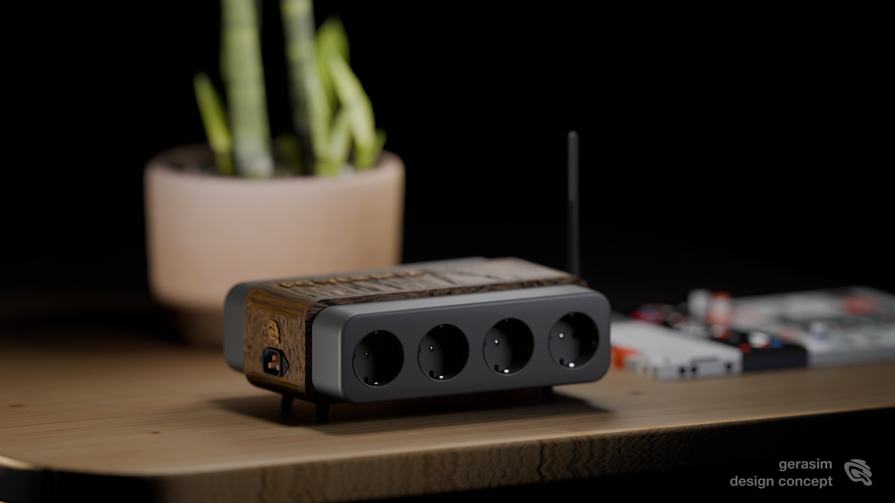

# PowerBox

  

PowerBox — проект универсальной коробки управления нагрузками 220V на 8 каналов.

Репозиторий хранит TouchDesigner-патчи, прошивки для ESP, тестовые скетчи, MIDI-эксперименты, схемы подключения, описание железа и инструкции по эксплуатации.

Проект развивается в двух версиях:

1. старая версия коробки на ESP8266 D1;
2. новая версия коробки на ESP32-S3 DevKitC-1 с внешней антенной.

---

## 1. Старая версия коробки

Старая версия PowerBox использует:

- ESP8266 на плате D1
- релейный модуль 8 каналов 12V
- реле с оптической развязкой
- управление 8 нагрузками 220V
- реле до 10A на канал, в пределах безопасной схемы подключения и реальной нагрузки
- управление через Wi-Fi / UDP

Эта версия остается в репозитории как legacy-вариант.
Старые прошивки и TouchDesigner-файлы могут использоваться как база, пример логики или источник рабочих решений при разработке новой коробки.

Папки:

- Firmware/legacy-esp8266-d1/
- TouchDesigner/legacy/

---

## 2. Новая версия коробки

Новая версия PowerBox использует тот же тип релейного модуля, но переходит на ESP32-S3.

Основной контроллер:

ESP32-S3-DevKitC-1 N16R8 c разъемом U.FL / IPEX / IPX для внешней антенны.

Особенности платы:

- ESP32-S3
- Wi-Fi
- Bluetooth
- USB-C
- поддержка Arduino
- поддержка ESP-IDF
- поддержка MicroPython
- внешняя антенна через U.FL / IPEX / IPX
- версия N16R8

Релейный модуль:

Релейный модуль 8 каналов 12V для Arduino с оптической развязкой, 220V 10A.

Характеристики:

- 8 каналов
- питание реле 12V
- оптическая развязка
- коммутация 220V
- до 10A на канал по паспорту модуля
- каждый канал управляет отдельной розеткой

Важно: значение 10A — это паспортная характеристика релейного модуля. Реальная допустимая нагрузка всей коробки зависит от схемы питания, предохранителя, сечения проводов, качества сборки, охлаждения и типа нагрузки.

Папки:

- Firmware/esp32-s3-main/
- TouchDesigner/current/
- Hardware/
- Docs/

---

## Возможности PowerBox

PowerBox позволяет управлять 8 каналами нагрузки:

- лампы 220V
- LED-лампы 220V
- блоки питания для низковольтных LED-лент
- световые приборы
- небольшие моторы и вентиляторы
- дым-машины или другие устройства, если они подходят по мощности
- любые безопасные нагрузки в пределах допустимой мощности реле, проводки и общей схемы питания

---

## Управление

Планируемые и используемые способы управления:

- UDP-команды из TouchDesigner
- веб-интерфейс ESP
- MIDI-сигналы
- Roland T-8 как MIDI-контроллер
- локальная Wi-Fi сеть
- fallback AP-режим ESP, если нет внешней сети

---

## UDP-протокол

Базовый UDP-порт:

4210

Примеры команд:

- ON 1
- OFF 1
- TOGGLE 1
- ALL ON
- ALL OFF
- STATUS
- 10101010

Где 10101010 — битовая маска для 8 каналов.

Примеры:

- 10000000 — включает первый канал и выключает остальные
- 11111111 — включает все 8 каналов
- 00000000 — выключает все 8 каналов

---

## TouchDesigner

TouchDesigner используется как визуальный контроллер для PowerBox.

Папки:

- TouchDesigner/current/ — актуальные патчи для новой коробки
- TouchDesigner/legacy/ — старые рабочие патчи для старой коробки
- TouchDesigner/tests/ — тестовые сцены, эксперименты и диагностика

---

## Firmware

Папки прошивок:

- Firmware/legacy-esp8266-d1/ — старые прошивки для первой версии коробки на ESP8266 D1
- Firmware/esp32-s3-main/ — основная новая прошивка для ESP32-S3-DevKitC-1 N16R8
- Firmware/esp32-c3-tests/ — тестовые прошивки для ESP32-C3
- Firmware/midi-t8-tests/ — тестовые скетчи и эксперименты для подключения Roland T-8 и MIDI-управления

---

## Archive

Папка Archive/UDPRele-original/ содержит исходную копию старой рабочей папки UDPRele с рабочего стола.

Она нужна как архив, чтобы ничего не потерять при сортировке файлов.

---

## Безопасность

PowerBox работает с напряжением 220V.

При сборке и эксплуатации нужно соблюдать электробезопасность:

- использовать предохранитель на вводе
- использовать IEC C14 с выключателем и fuse
- не превышать ток реле
- не превышать допустимую нагрузку всей коробки
- учитывать пусковые токи ламп, блоков питания, моторов и дым-машин
- использовать правильное сечение проводов
- разделять силовую и управляющую часть
- не работать с открытой коробкой под напряжением
- проверять изоляцию и заземление
- подписывать каналы, провода и розетки
- использовать кабельные вводы и фиксацию проводов

---

## План развития

- [ ] Разобрать папку Archive/UDPRele-original/
- [ ] Перенести старые ESP8266-прошивки в Firmware/legacy-esp8266-d1/
- [ ] Перенести новые ESP32-S3-прошивки в Firmware/esp32-s3-main/
- [ ] Перенести ESP32-C3-тесты в Firmware/esp32-c3-tests/
- [ ] Перенести MIDI / Roland T-8 тесты в Firmware/midi-t8-tests/
- [ ] Разложить TouchDesigner-файлы по current, legacy, tests
- [ ] Добавить точную схему подключения новой коробки
- [ ] Добавить таблицу соответствия реле и розеток
- [ ] Добавить диагностику ESP / Wi-Fi / UDP / TouchDesigner / MIDI
- [ ] Добавить фотографии коробки и железа

<!-- PRESENTATION_SUMMARY_START -->

## Presentation / описание устройства

В папке `Docs/Presentation/` лежат материалы с описанием PowerBox: что это за устройство, зачем оно нужно, как его можно использовать и чем оно полезно для инсталляций, света, TouchDesigner-сцен и управления нагрузками.

Изображение `Assets/powerbox-cover.png` используется как обложка README.

### Файлы из Presentation

- [1.png](Docs/Presentation/1.png)
- [2.png](Docs/Presentation/2.png)
- [3.png](Docs/Presentation/3.png)
- [4.png](Docs/Presentation/4.png)
- [5.png](Docs/Presentation/5.png)
- [6.png](Docs/Presentation/6.png)
- [PowerBox.pdf](Docs/Presentation/PowerBox.pdf)
- [🔌 PowerBox — умное управление питанием с Wi-Fi и MIDI.pdf](Docs/Presentation/🔌%20PowerBox%20—%20умное%20управление%20питанием%20с%20Wi-Fi%20и%20MIDI.pdf)

### Самое важное из описаний

Markdown-файлы в папке `Docs/Presentation/` не найдены, поэтому тезисы пока не добавлены автоматически.

### Назначение PowerBox

PowerBox — это аппаратно-программная коробка для управления 8 каналами нагрузки 220V. Она нужна, чтобы быстро подключать свет, блоки питания, сценографические элементы и другие устройства к управлению из TouchDesigner, UDP, Wi-Fi, web UI или MIDI.

Ключевая польза проекта:

- собрать в одном месте прошивки, TouchDesigner-патчи и документацию;
- сохранить старую рабочую версию коробки на ESP8266 D1;
- развивать новую версию на ESP32-S3 с внешней антенной;
- иметь понятное описание железа, протоколов и сценариев использования;
- быстро возвращаться к проекту без потери контекста по подключению и логике работы.

<!-- PRESENTATION_SUMMARY_END -->

## HTML-презентация

- [Открыть презентацию PowerBox](https://yogerasim.github.io/PowerBox/presentation.html)
- [GitHub-репозиторий проекта](https://github.com/Yogerasim/PowerBox)

## GitHub Pages

- [Публичная HTML-презентация](https://yogerasim.github.io/PowerBox/presentation.html)
